[TOC]

<div STYLE="page-break-after: always;"></div>


## 功能简介

### 鼠标操作

- 指尖移动来操控鼠标移动：通过手指的相对移动与移动的速度来操纵鼠标的移动
- 手势操控实现鼠标点击功能：通过指尖的特定动作实现鼠标的点击
- 手势操控实现滚动页面：通过特定的手势实现页面的滚动

### 键盘操作

- 指尖操控虚拟键盘:用户可以通过手指点选虚拟键盘来进行输入

### 快捷手势操作

- 手势识别实现特定按键的触发：通过特定的手势触发某些按键的功能。
- 用户自定义手势对应功能：用户可以自定义某些手势所对应到功能选项。

### 界面显示

- 用户及系统设置主界面:用户可以修改手势对应的功能，以及如鼠标灵敏度、页面滚动速率等系统配置
- 以悬浮窗实时显示当前手部检测状态:利用PySide2实现桌面悬浮窗来实现手部的骨架图
- 以悬浮窗实时显示当前操控模式:利用PySide2实现桌面悬浮窗来显示当前手势操控模式

### 手部识别

- 通过神经网络实现手势检测与识别:利用opencv自动追踪手掌位置，截取手部图像，利用神经网络对手势进行分类

## 系统总体设计

<center>    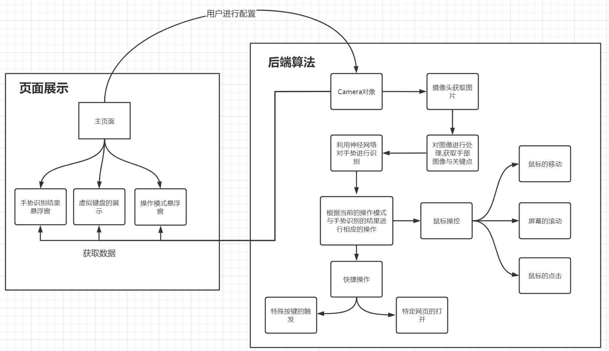    <br>    <div style="color:orange; border-bottom: 1px solid #d9d9d9;    display: inline-block;    color: #999;    padding: 2px;">系统总体设计</div> </center>

本项目主要分为两个部分，分别是前端的页面展示和后端的算法。

在页面展示中，主页面可以对快捷手势操作设定以及鼠标移动速率，滚轮的灵敏度等多个数值进行自定的调节，并将调节后的数值保存在项目的配置文件当中。在主页面中点击运行手势操控鼠标或者快捷指令按钮，并可以使主程序开始运行，同时打开手势识别结果悬浮窗以及操作模式的悬浮窗，给予用户当前操作模式与手势识别的信息展示。

而在后端算法中，camera对象是整个算法的核心。在camera对象的函数中，我们首先通过摄像头获取当前的原始图片。然后通过对图像进行处理与识别，获取手部的关键图像与关键点。然后将截取的关键图像进行预处理后送入神经网络对手势进行识别。然后根据神经网络识别的结果。进行模式的切换以及相应的操作。而在鼠标操控的模块，可以根据手势进行鼠标的移动，屏幕的滚动以及鼠标的点击等操作。如果是在快捷操作模式，则可以根据手势来实现特定事件的触发或者是实现特定网页的打开等操作。

## 系统模块实现

### 主界面的架构设计

主界面的设计主要包含了三个部分: 窗体部分, 工具类部分, 样式部分

#### 窗体部分

主界面的窗体主要由以下几个部分构成:
1. `MainWindow.py` ,`MainWindow`是本程序的主窗体以及整个程序的入口, 继承自`PySide`的`QWidget`类, 其主要用于处理各子窗口的布局以及处理对悬浮窗、相机等的调用。

2. `UserConfigWindow.py` ,`UserConfigWindow`是用来处理用户快捷手势自定义的界面, 其中显示手势的展示框用了`QWidget`类, 展示框右侧的则使用下拉框和文本框的形式用于用户设置和操作。整个快捷手势部分放在了滚动条区域内, 如果后续需要增减某些手势功能可以很方便地实现增减。
3. `SystemconfigWindow.py`  `SystemconfigWindow`是用来设置全局鼠标控制的一些基本属性, 目前主要有三个: 鼠标灵敏度、页面滚动速率、手势识别速度。采用滑块加上数字框的方式进行显示, 方便用户进行调节, 可以直接拖动滑块或者输入指定值进行调整设置。
4. `HelpWindow.py` ,`HelpWindow`用来显示一些基本帮助及说明, 主要是用几个不同样式的`QLabel`进行实现。

#### 工具类部分

对于某些经常要使用到的功能和组件, 单独封装成py文件方便调用, 也可以使代码逻辑更加分明。主要用到以下几个工具类。

1. `KeyBoardMap.py` 用于实现键盘按键的`Qt.Key_XXX`的值到其对应名称字符串的映射。
2. `MyLoading.py` 用于显示加载中的图标, 主要原理是通过`QLabel`播放加载中的gif, 然后用外层的`QLabel`实现遮罩层。
3. `MyMessageBox.py` 用于实现自定义的消息弹窗, 效果是在界面正上方显示一个渐变出现并自动消失的信息窗口, 比`PySid`e自带的消息弹窗有更好的效果。该类继承自`QWidget`, 通过在`timerEvent`对位置和透明度进行调整已达到该效果。
4. `PropertiesHandler.py` 用于配置文件的读取、创建、保存等。主要包含一些基本的文件读写操作。
5. `ThreadUtils.py` 由于threading类生成的子线程在终止时比较麻烦, `ThreadUtils`主要提供线程终止的操作, 实现方式是通过在线程中抛出异常来终止线程。
6. `MyTabWidget.py` 是一个通过标签切换窗口的自定义组件, 继承自`PySide`的`QTabWidget`类, 附加的功能是窗体切换时的动画, 由于qt中的子窗口无法直接进行透明度调节, 故本动画实现主要是通过对窗体的`QGraphicsOpacityEffect`视图效果类进行透明度调节, 动画用`QPropertyAnimation`类实现。

#### 样式部分

本程序采用界面布局和样式设计分离的思路实现, 窗体部分用于布局, 样式则使用qss进行调整, 以上的各个窗体都有其对应的qss文件, 所有qss文件均放在resources的qss文件夹下。qss文件中则主要调整各窗体以及组件的背景色、字体、鼠标悬浮效果等属性。
样式部分还包括一些动画效果的设计。例如`MyMessagesBox`和`MyTabWidget`的动画。

#### 与悬浮窗和camera对象的配合过程

该过程主要在`MainWindow`类中实现。在`MainWindow`类中存储一个`Camera`对象、`Camera`线程对象、`Keyboard`对象和各个悬浮窗对象。通过"启动鼠标控制"和"启动快捷手势控制"两个按钮来控制悬浮窗的产生、两种相机对象的创建以及相机线程的创建, 再通过"停止"按钮来控制悬浮窗的隐藏、相机对象的销毁以及相机线程的销毁。

### 用户配置的配置文件的设计

1.配置采用properties格式的文件进行保存, 即`settings.properties`, 基本格式是每一行`key=value`。
2.配置文件的读写都通过`PropertiesHandler`来实现, 将读取到的所有key和value返回。其中还包含一些对配置文件完整性的检查, 若配置文件缺失, 则会自动生成一个配置文件, 若配置文件某些key值缺失或者冗余, 或者某些key对应的value格式不正确, `PropertiesHandler`都会做出一定的处理, 例如删除冗余key值, 对缺失或错误的配置项替换为默认值并重新写入文件。

### 悬浮窗的架构设计与实现

​	 本项目通过`PySide2`设计了一个悬浮窗的基类`FLoatingWindow`，在该类的基础上，派生出了两个悬浮窗`GestureFloatingWindow`和`ModelFloatingWindow`，分别用来显示当前手势对应的骨架图以及当前模式及事件和鼠标的当前位置等。

<center>    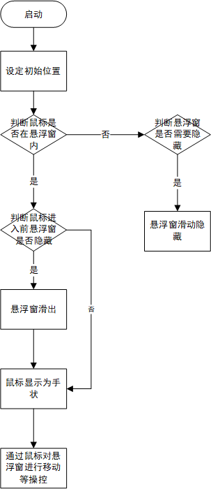    <br>    <div style="color:orange; border-bottom: 1px solid #d9d9d9;    display: inline-block;    color: #999;    padding: 2px;">悬浮窗流程图</div> </center>


​	对于`FloatingWindow`基类，在`init`时通过`self.setWindowFlags(Qt.FramelessWindowHint | Qt.WindowStaysOnTopHint | Qt.Tool)`	将窗口设置为无边框并将窗口置顶。通过`self.setWindowOpacity(0.5)`将窗口透明度设置为0.5。通过`self.setCursor(Qt.PointingHandCursor)`,当鼠标移动到悬浮窗上时，将鼠标设置为手状。并在初始化时定义了一个类成员变量_hidden来标记悬浮窗是否隐藏。通过`self.startTimer(100)`设置悬浮窗每100ms刷新一次。

​	悬浮窗可以通过鼠标点击进行拖拽移动。鼠标在进入和离开悬浮窗时，会通过hideOrShow函数判断悬浮窗是否需要滑出或隐藏。若鼠标进入前悬浮窗处于隐藏状态，则悬浮窗会滑出；若鼠标离开后经过坐标检测，发现悬浮窗已经贴到了屏幕边缘，则悬浮窗会隐藏。在悬浮窗滑动时，会调用startAnimation函数展示滑动效果，并在多屏时采用不同的隐藏方法，防止滑动框跨屏。

#### 悬浮窗展示Camera对象的信息

<center>    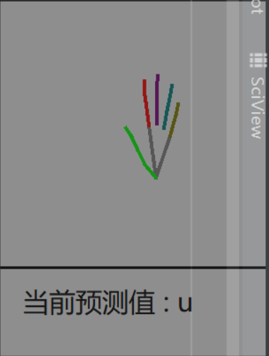    <br>    <div style="color:orange; border-bottom: 1px solid #d9d9d9;    display: inline-block;    color: #999;    padding: 2px;">骨架悬浮窗</div> </center>

​	对于`GestureFloatingWindow`悬浮窗，在初始化时传入了一个`camera`对象，通过`camera`对象里的_points数组获得屏幕前手掌的21个关节的位置，然后通过特定的顺序将关节连接起来，绘制出手掌的骨架图。并在下方显示出当前手势的预测值。悬浮窗会定时刷新来更新手掌位置以及手势预测值。

<center>    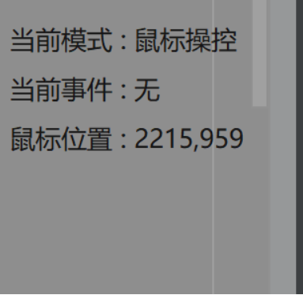    <br>    <div style="color:orange; border-bottom: 1px solid #d9d9d9;    display: inline-block;    color: #999;    padding: 2px;">模式悬浮窗</div> </center>

​	对于`ModelFloatingWindow`悬浮窗，在初始化时同样传入了一个`camera`对象，通过`camera`对象里的mouse_status属性来获取当前鼠标的模式，并通过`pyautogui`类库获取当前鼠标的位置。定时的更新当前模式(如鼠标操控、屏幕滚动、快捷操作)、当前事件(如鼠标点击、屏幕滚动)以及当前鼠标在屏幕中的绝对位置。

### 虚拟键盘的展示

​	通过`Pyside2`绘制了一个虚拟键盘类`MyKeyboard`，定时检测`camera`对象中的`mouse_status`属性。当`mouse_status == 2` 时，说明当前需要绘制虚拟键盘。将`camera`中`keyboard_image`属性转化为`Pyside2`中的`QImage`对象，

然后将其绘制到屏幕中，通过`self.setWindowFlags(Qt.FramelessWindowHint | Qt.WindowStaysOnTopHint | Qt.Tool)`将虚拟键盘设置为无边框并置顶。

<center>    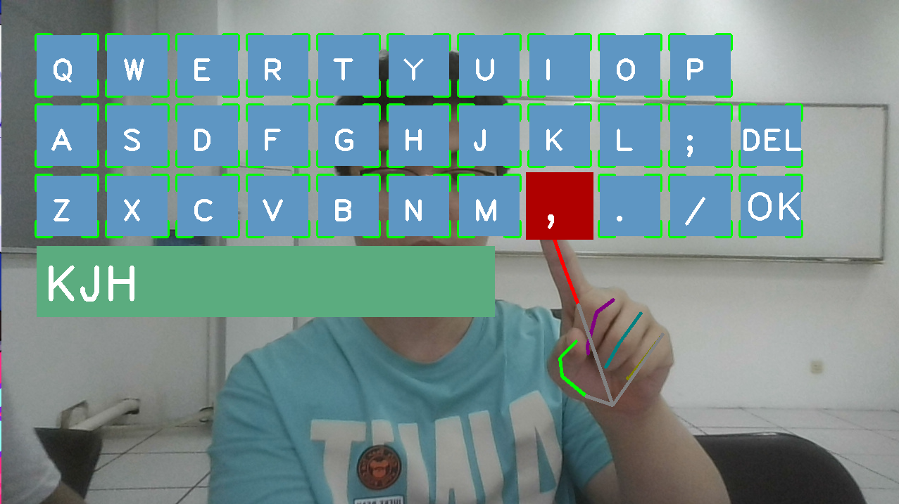    <br>    <div style="color:orange; border-bottom: 1px solid #d9d9d9;    display: inline-block;    color: #999;    padding: 2px;">虚拟键盘的展示</div> </center>

### Camera对象的架构与设计

#### 基本架构设计

`camera`模块实现了本程序最核心的功能，包括调用计算机的摄像头，获取每一帧的图片，对图片进行处理获得其骨架图，截取骨架图中的关键区域，并将其传入到训练好的神经网络模型中，得到预测的结果，并根据得到的预测结果，执行相对应的操作。

本模块包括一个`Camera`类以及一系列相关的辅助函数。

#### 流程图

<center>    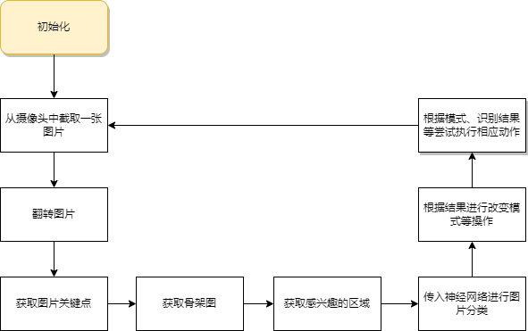    <br>    <div style="color:orange; border-bottom: 1px solid #d9d9d9;    display: inline-block;    color: #999;    padding: 2px;">图像识别全流程</div> </center>

#### Camera类介绍

`Camera`类保存了许多手势识别全过程中的需要的变量。主要在`__init__`函数中处理。

```python
def __init__(self, model_path, class_names, mode):
    # 读取配置文件
    self.properties = PropertyHandler('settings.properties').get_properties()
    # 加载模型
    self.model = dnn.readNetFromTensorflow(model_path)
    # 设置类别名
    self.class_names = class_names
    # 设置摄像头
    self.capture = cv.VideoCapture(0)
    self.capture.set(cv.CAP_PROP_FRAME_WIDTH, 1280)
    self.capture.set(cv.CAP_PROP_FRAME_HEIGHT, 720)
    # 设置手势识别
    self.hands = mp.solutions.hands.Hands(False, min_detection_confidence=0.3, min_tracking_confidence=0.3)
    # 关键坐标点（原始）
    self.points = []
    # 设置模式
    self.mode = mode
    self.mouse_status = MOUSE_MOVING
    # 记录开始改变状态的时间
    self.change_begin_time = 0
    # 需要保持该手势持续的时间,以改变状态
    self.keep_time = self.properties['gesture_recognition_speed'] / 50
    # 动作对象
    self.command_map = {}
    self.mouse_moving = MouseMoving.MouseMoving()
    self.scroll_screen = ScrollScreen.ScrollScreen()
    self.string_action = StringAction.StringAction(properties=self.properties)
    # 预测值
    self.predicted_value = None
    # 保存的图片
    self.origin_image = None
    # 虚拟键盘
    self.virtual_keyboard = None
    self.keyboard_image = None
```

#### 相应函数介绍

##### Camera类中的函数

下面函数需要使用或更新`Camera`类中的变量。

###### 获取一帧图像

函数原型为`get_frame_image(self)`，最后返回当前帧的翻转图片。

使用`opencv`中的`VedioCaptrue`函数来调用计算机的摄像头，并使用`filp`函数来镜像翻转操作，使画面中手的移动规律更加符合直觉，之后设置类中的image变量，方便其他函数使用。

###### 传入图像获得关键点

函数原型为`get_critical_hands_points(self, image)`，返回图片中的关键点。

使用Google的开源框架`mediapipe`，对图片进行处理，获取图片中的关键点，并更新类中的points变量，方便其他函数判断是否可以执行，并减少反复处理图片开销巨大的问题。

###### 使用神经网络对处理好的图片进行分类操作

函数原型为`change_mouse_status(self, pre_class_id, class_id)`，返回图片的分类结果。

传入图片，并使用`Camera`类中的初始化过程中加载的模型进行预测操作。根据最大的索引编号，得到预先定义的类别名称。

如下所示

```python
def categorize_image(self, image):
    # 调整图像大小
    image_resized = cv.resize(image, (100, 100))
    # 将图像转换为blob格式
    image_blob = dnn.blobFromImage(image_resized,
                                   scalefactor=1.0 / 225.,
                                   size=(100, 100),
                                   mean=(0, 0, 0),
                                   swapRB=False,
                                   crop=False)
    # 使用加载好的神经网络模型
    net = self.model
    net.setInput(image_blob)
    # 得到预测结果
    result = net.forward()
    result = result.flatten()
    # 获取预测结果对应的索引
    class_id = np.argmax(result)
    return self.class_names[class_id]
```

###### 封装手势识别全部操作

将全部基本操作封装起来，便于调用。

```python
# 手势识别全操作，包括获取关键点，获取感兴趣的区域
def gesture_recognition(self, image):
    critical_points = self.get_critical_hands_points(image)
    if len(critical_points):
        # 获取黑色底图
        black_image = np.zeros(image.shape, dtype=np.uint8)
        # 识别出骨架图
        bone_image = get_bone_image(black_image, critical_points)
        # 截取手部的ROI
        roi_image = get_roi(bone_image, critical_points)
        # 送入神经网络进行识别
        class_id = self.categorize_image(roi_image)
        # 根据识别的结果判断模式的切换与否
        self.change_mouse_status(self.predicted_value, class_id)
        self.predicted_value = class_id
```

###### 尝试改变操控模式

函数原型为`change_mouse_status(self, pre_class_id, class_id)`

设定一个切换所需时间，若本次识别的结果与上一次识别结果相同，且保持了设定的相应时间，则尝试进行操控模式的切换。

###### 尝试执行操作

函数原型为`execute_action(self, points)`

判断当前的模式，之后根据当前的模式、手势识别的结果、以及各个关节对应的关键点，调用自己编写的Action模块的不同操作。

##### 其他辅助函数

以下函数为辅助函数，定义在`Camera`类外，方便其他模块调用。

###### 获取感兴趣的区域（ROI）

函数原型为`get_roi(image, points)`

根据骨架图以及获取的关键点，获取感兴趣的区域。

找到中指根部对应点的坐标，该坐标可以认为是手的中心点，通过该点上下左右扩展固定的像素，这样便将关键区域截取了出来。

```python
# 根据骨架图和获取的关键点，获取感兴趣的区域
def get_roi(image, points):
    # 获取图片的尺寸
    image_height, image_width = image.shape[0], image.shape[1]
    # 获取中心点（中指根部）坐标
    center_x, center_y = points[9]
    center_x *= image_width
    center_y *= image_height
    center_x = int(center_x)
    center_y = int(center_y)
    # 获取上下左右边界
    x_left, x_right = int(max(center_x - 200, 0)), int(min(center_x + 200, image_width - 1))
    y_top, y_bottom = int(max(center_y - 200, 0)), int(min(center_y + 200, image_height - 1))
    # 截取图片
    pic = image[y_top:y_bottom, x_left:x_right]
    return pic
```

###### 绘制骨架图

函数原型为`get_bone_image(image, points)`

根据传入的关键点，将点映射到真实图片的位置，使用`OpenCV`绘制骨架图，方便之后传入神经网络进行识别。

将手指的关节使用不同颜色的线进行相连，便于区分五根不同手指以及手掌区域。

### 快捷指令的架构与设计

#### 基本架构设计

为方便所有快捷指令的执行,我们设计了`BaseAction`类作为所有`Action`类的基类.

快捷指令继承了`BaseAction`类，设计`StringAction`类，将识别结果映射，读取配置文件得到对应操作的字符串，之后将每个字符串转化成相应的指令。

指令包括按下对应按键、打开指定的网页等操作，这些操作对应的参数都可以通过前端界面对配置文件进行修改。

#### 相关函数介绍

##### 初始化

初始化的过程包括对手势识别的结果映射成为配置文件对于的key

```python
def __init__(self, properties):
    super().__init__()
    # 将识别结果映射
    self.cmd_dict = {
        'l': 'left',
        'r': 'right',
        'u': 'up',
        '0': 'zero'
    }
    # 配置文件
    self.properties = properties
    # 设置每个手势识别间隔的时间
    self._STOP_DURATION = 2
    # 当前指令
    self.command = None
```

##### 执行动作

读取配置文件中的按键以及网页url，使用`pyautogui`和`webbrowser`库执行对应的动作。

同时，为了避免连续识别到同一手势，导致连续不断执行同一指令，每次执行指令后，都为动作设置了不应期，只有上次动作执行后经过一段时才能够执行下一个动作。

```python
def action(self):
    if self._can_action:
        # 获取动作名
        action_name = self.properties[self.command + '_action']
        if action_name == 'press_key':
            # 按下按键
            pag.press(self.properties[self.command + '_action_key'])
        elif action_name == 'open_url':
            # 打开网页
            webbrowser.open(self.properties[self.command + '_action_url'], new=0, autoraise=True)
        # 设置为不可操作
        self._can_action = False
        self._stop_time = time.time()
    else:
        if time.time() - self._stop_time > self._STOP_DURATION:
            # 解放操作
            self._can_action = True
```

### 鼠标操控的架构与设计

#### 鼠标移动的模块

鼠标移动的模块为`MouseMoving`类,其继承于`BaseAction`,并且重写了`action`方法。在`action`方法中，获得由`camera`对象传入的手部关键点的坐标，并且计算出本次手指移动的相对距离。

然后判断当前是否在鼠标操控的不应期当中，如果不是,则判断是移动的相对坐标是否小于某个特定值。如果是便可以尝试进行点击操作，否则重新开启一个线程，执行鼠标的移动操作，如果当前正在鼠标操控的不应期当中，则检测当前的时间。与鼠标进入不应期时间的时间差是否超过我们所特定的时间差。如果是，则解除当前鼠标操控对象的不应期状态。

```python
# 判断是否在不应期
        if self._can_action:
            # 是否可以尝试点击
            if abs(x_m) < 15 and abs(y_m) < 15:
                self.try_click(points)
            else:
                # 开启新的线程，移动鼠标
                _thread.start_new_thread(self.move, (x_m, y_m,points))
                # self.move(x_m, y_m, points)
        else:
            # 判断是否可以解除不应期
            if time.time() - self._stop_time > self._STOP_DURATION:
                self._can_action = True
                self._stop_time = 0

        # 更新上次鼠标的位置
        self._last_x = x_r
        self._last_y = y_r
```

而在鼠标移动的函数当中，首先会获取到由参数传入的手指在x轴和y轴方向移动的相对距离。如果移动的相对距离大于定的值，我们则认为本次操作是一次快速移动，代表着鼠标将从屏幕的上方移动到下方，或者是将从左方移动到右方。而操作者的手部将会进行较大范围的移动。为了使操作者的手部的相对位置不发生大的改变。让操作者在执行该动作后，有空余时间将手指回到原处，在进行快捷操作后会有0.5秒的不应期时间，在此时间内操作者手部动作不会对鼠标鼠标动进行影响，从而使操作者有时间将位移距离较大的手部重新恢复到舒适的距离范围内。并且移动的距离也会放大相应的倍数。

```python
        if abs(x_m) > 370 or abs(y_m) > 270:
            # 快速移动
            x_m = int(x_m * 4)
            y_m = int(y_m * 3.5)
            # 鼠标灵敏度的调整
            x_m = self.mouse_sensitivity*x_m
            y_m = self.mouse_sensitivity*y_m
            self._stop_time = time.time()
            self._can_action = False
            pag.moveRel(x_m, y_m, duration=0.25)
```

<center>    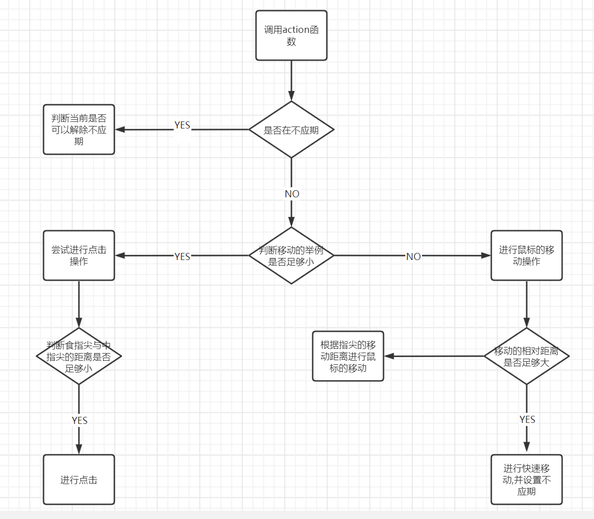    <br>    <div style="color:orange; border-bottom: 1px solid #d9d9d9;    display: inline-block;    color: #999;    padding: 2px;">鼠标操控模块流程图</div> </center>

#### 屏幕滚动的模块

鼠标移动的模块为`ScrollScreen`类,其继承于`BaseAction`,并且重写了`action`方法。在`action`方法中，获得由`camera`对象传入的手部关键点的坐标。

其`action`函数的流程与鼠标移动模块`action`函数类似，在获得手部的坐标后，首先判断是否在不应期内，

如果不在，则判断当前手部移动的纵坐标是否大于一定的阈值。如果大于则根据手部移动的方向执行相应的屏幕滚动操作。在每次进行屏幕滚动操作后，设置一定的不应期，以免造成操作的频率过高。影响用户体验

```python
    def action(self, points):
        if len(points) == 0:
            return
        # 当前的手指位置
        y_r = points[8][1] * 1600
        if self._can_action:
            if self._last_y == 0:
                self._last_y = y_r
            else:
                # 移动的相对坐标
                y_m = y_r - self._last_y
                if abs(y_m) > 500:
                    pag.scroll(int(y_m * 1.5 * self.scroll_speed))
                    self._stop_time = time.time()
                    self._can_action = False
                self._last_y = y_r
        else:
            if time.time() - self._stop_time > self._STOP_DURATION:
                self._can_action = True
                self._stop_time = 0
```

### 虚拟键盘的架构与设计

虚拟键盘写在`VirtualKeyboard`类中，其继承了`BasetAction`类，重写了`action`方法

在`action`首先获得由`camera`对象传来的手部关键点的坐标以及当前帧摄像头所捕捉到的原始图片。

然后再`Drawall`函数中首先将键盘的所有按键画在由摄像头捕捉的原始图片上。

```python
 # 绘制键盘
    def draw_all(self, image, button_list):
        # 绘制全部按钮
        for button in button_list:
            x, y = button.pos
            w, h = button.size
            cvzone.cornerRect(image, (button.pos[0], button.pos[1], button.size[0], button.size[1]),
                              20, rt=0)
            cv2.rectangle(image, button.pos, (x + w, y + h), (195, 150, 94), cv2.FILLED)
            # 绘制DEL键
            if button.text == 'DEL':
                cv2.putText(image, button.text, (x, y + 65),
                            cv2.FONT_HERSHEY_PLAIN, 3, (255, 255, 255), 4)
                # 绘制OK键
            elif button.text == 'OK':
                cv2.putText(image, button.text, (x + 5, y + 65),
                            cv2.FONT_HERSHEY_PLAIN, 4, (255, 255, 255), 4)
            else:
                # 绘制其他按键
                cv2.putText(image, button.text, (x + 20, y + 65),
                            cv2.FONT_HERSHEY_PLAIN, 3, (255, 255, 255), 4)
        # 绘制下方输入框
        cv2.rectangle(image, (50, 350), (700, 450), (127, 172, 91), cv2.FILLED)
        cv2.putText(image, self.final_text, (60, 430),
                    cv2.FONT_HERSHEY_PLAIN, 5, (255, 255, 255), 5)
        return image
```

然后检测食指指尖的坐标与每一个按键的坐标是否存在重合。如果存在重合，则改变该按键的颜色，表示虚点。然后在此基础上检测到食指指尖与中指指尖的坐标，如果食指指尖与中指指尖的坐标重合则认为是进行了一次点击操作。将键盘的文本值输入到下方的输入框中，并储存起来。如果点击ok键会将用户所输入的所有的文本值输入到对应的文本框当中。并且改变当前的操控模式为鼠标操控。

<center>    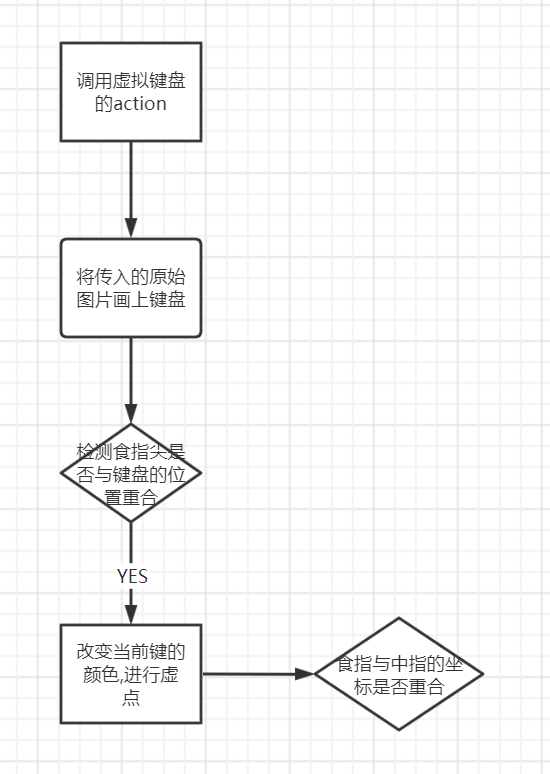    <br>    <div style="color:orange; border-bottom: 1px solid #d9d9d9;    display: inline-block;    color: #999;    padding: 2px;">虚拟键盘流程图</div> </center>

### 神经网络模型的训练过程

#### 数据集的收集与预处理

数据集内容：本项目采用的数据集是特定手势的数据集。由于项目需要，我们最终所有的数据集均采用自己拍摄的不同场景下的手势图片作为数据集。本项目数据集分为鼠标控制数据集和快捷键控制数据集。每个手势分别拍摄了不同方向、不同角度下的照片各200张，这些手势的原始图片分别存储在`dataSet`文件夹中子文件夹下，图片上级文件夹名称即为图片的标签。

**鼠标控制数据集：**

在本数据集中，手势`5`用来切换鼠标操控模式和屏幕滚动模式。在鼠标操控模式下，摄像头通过检测食指指尖的位置来操纵鼠标移动，通过检测食指指尖与中指指尖的距离来进行鼠标的点击操作。

保持`5`手势一段时间后，实现鼠标操控模式与屏幕滚动模式的切换。在屏幕滚动模式下，`1`手势用来屏幕滚动模式下的屏幕滚动功能，手指向上滑动为屏幕向下滚动，向下滑动为屏幕向上滚动；`2`手势用来召唤出虚拟键盘，通过`cvzone`库在显示出虚拟键盘，通过检测食指指尖的位置来进行不同按键位置的切换，通过检测食指指尖与中指指尖的距离来实现按下键盘功能。如果在进入虚拟键盘前鼠标光标所在位置可以进行输入，在点击虚拟键盘OK键后，会将在键盘中点击的按键内容输入到输入框中。

<center>    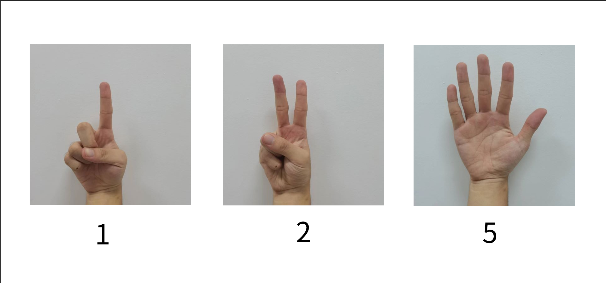   <br>    <div style="color:orange; border-bottom: 1px solid #d9d9d9;    display: inline-block;    color: #999;    padding: 2px;">手势125</div> </center>

**快捷键控制数据集：**

在本数据集中，我们为不同手势赋予了不同的快捷键或者打开特定网页操作，用户也可以在主界面自定义修改这些手势对应的快捷键，使得任意手势对应某个按键或者打开网页操作。初始时我们将up手势设置为打开某个网站，用户也可以通过主界面修改网站地址。l和r手势分别初始设置为键盘的LEFT和RIGHT键。

<center>    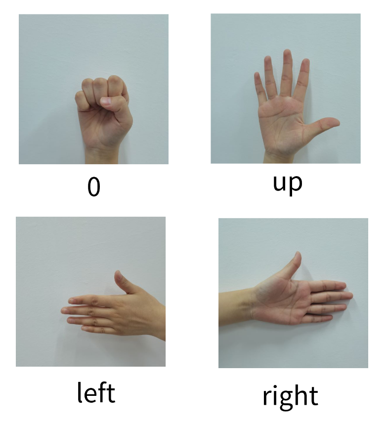    <br>    <div style="color:orange; border-bottom: 1px solid #d9d9d9;    display: inline-block;    color: #999;    padding: 2px;">手势0ulr</div> </center>

#### CNN模型的训练过程

在拍摄完数据集之后,需要先对数据集进行预处理的操作,

- 首先需要对数据的图片进行压缩的处理,使用`opencv`的`resize`函数

```python
image = cv2.resize(image, (100, 100))
```

将图片转换为100*100的大小,为后期的训练做准备

- 然后利用谷歌的开源框架`mediapipe`将数据集中的手部识别出来，获取到关键点的坐标数据，然后利用坐标的关键数据画出手部的骨架图，并绘制在一张黑色的图像上。以达到手部关键位置的识别与标注。

  ```python
  #获取手部的识别器
  mp_hands = mp.solutions.hands
  hands = mp_hands.Hands(True, 1, min_detection_confidence=0.3, min_tracking_confidence=0.3)
  #处理图片
  results = hands.process(image)
  ```

- 然后从处理的图片中抽取1/6作为数据的测试集

对数据集进行预处理之后，然后就是进行手势识别的模型训练，首先是对数据集中图片的读取操作。利用pathlib对传入的数据集根目录下的每个子目录进行遍历，获得每一张图片的路径，并且获取子目录的名次作为数据的标签。

```python
def read_data(path):
    path_root = pathlib.Path(path)
   
    image_paths = list(path_root.glob('*/*'))
    # 遍历子目录
    image_paths = [str(path) for path in image_paths]
    random.shuffle(image_paths)
    image_count = len(image_paths)
    # 获取label
    label_names = sorted(item.name for item in path_root.glob('*/') if item.is_dir())
  
    label_name_index = dict((name, index) for index, name in enumerate(label_names))
    # 获取图片path
    image_labels = [label_name_index[pathlib.Path(path).parent.name] for path in image_paths]
   
    return image_paths,image_labe
```

随后，利用`tensorflow`的`tf.data.Dataset.from_tensor_slices`函数将数据与标签整合在一起，然后通过图像路径获取到图片的数据。以创建`tensorflow`训练所需要用的数据集。

```python
#对图片进行归一
def preprocess_image(image):
    image = tf.image.decode_jpeg(image, channels=3)
    image = tf.image.resize(image, [100, 100])
    # normalize to [0,1] range
    image /= 255.0  
    return image
# 读取图片
def load_and_preprocess_image(path,label):
    image = tf.io.read_file(path)
    return preprocess_image(image),label
#创建数据集
def creat_dataset(image_paths,image_labels,bitch_size):
    db = tf.data.Dataset.from_tensor_slices((image_paths, image_labels)) 
    dataset = db.map(load_and_preprocess_image).batch(bitch_size)  
    return dataset
```


然后是创建我们cnn网络的结构，我们的网络结构有三个卷积层，两个池化层，两个全连接层以及一个输出层。第一层卷积层有32个卷积核，每个核的大小是5×5。第二层和第三层的卷积层都有64个卷积核，每一个核的大小为3×3。都使用relu作为激活函数。在全连接层中，第一层有512个神经元，输出层的神经元素与数据集中的样本类别相同。


```python
 network = keras.Sequential([
     		# 32个卷积核的卷积层
            keras.layers.Conv2D(
            32,kernel_size[5,5],padding="same",activation=tf.nn.relu),
     		# 2 * 2的最大池化层
            keras.layers.MaxPool2D(
            pool_size=[2, 2], strides=2, padding='same'),
     		# 64个卷积核的卷积层
            keras.layers.Conv2D(
            64,kernel_size=[3,3],padding="same",activation=tf.nn.relu),
     		# 2 * 2的最大池化层
            keras.layers.MaxPool2D(
     		pool_size=[2, 2], strides=2, padding='same'),
     		# 64个卷积核的卷积层
            keras.layers.Conv2D(
            64,kernel_size=[3,3],padding="same",activation=tf.nn.relu),
            keras.layers.Flatten(),
     		# 全连接层
            keras.layers.Dense(512,activation='relu'),
     		# 随机丢弃神经元
            keras.layers.Dropout(0.5),
     		# 全连接层
            keras.layers.Dense(128,activation='relu'),
            keras.layers.Dense(3)])
  network.build(input_shape=(None,100)
```

在训练完成之后将模型保存为pb格式的文件。

此外，为了加快模型训练的速度，我们使用google的kaggle算力平台进行模型的训练，可以极大的减少训练所消耗的时间。

## 系统测试

在每个重要模块，以及程序全部功能实现后，都进行相应的测试。测试内容如下

- 测试`mainWindow`类中窗口显示是否正常，字体显示比例，每个按钮对应功能是否正常

- 测试各个悬浮窗窗口显示是否正常，是否能够正常显示手的骨架图，显示当前鼠标的操作模式。

- 测试配置文件的读取与保存是否正常，在前端改变选项框并保存，查看是否能够在配置文件中找到对应的。

- 测试神经网络模型功能是否正常。

- 测试鼠标操控（包括鼠标移动、鼠标点击、滚动屏幕等操作）是否正常，不应期、灵敏度等的调整是否能够实现。

- 测试快捷指令功能是否正常，能否按下配置文件存储的按键，能否打开指定的网页。

- 测试安装程序是否正常运行,是否能正常卸载

- 测试安装好的程序功能是否正常

## 系统安装手册

### 下载安装包

我们为我们的软件制作了安装程序,在下载好安装程序之后后，双击程序便可以进行安装。请注意,在安装的过程中，请不要将软件安装在C盘系统盘,否侧可能会引发一些操作权限的冲突,安装完成之后会在桌面显示我们软件的图标，双击图标便可以正常运行。

<center>    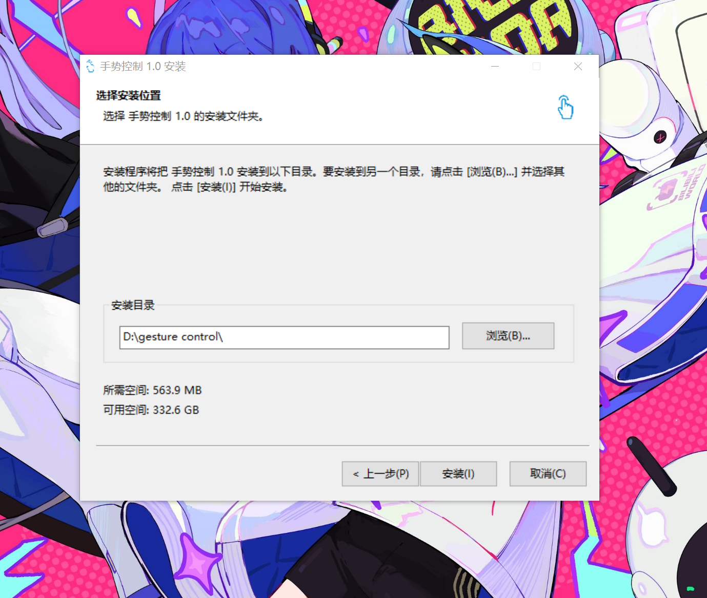   <br>    <div style="color:orange; border-bottom: 1px solid #d9d9d9;    display: inline-block;    color: #999;    padding: 2px;">安装程序</div> </center>

### 源码级别运行

如果需要从源码级别运行我们的程序,则使用`Pycharm`以项目的形式打开目录`gesture_control_app`，然后下载好`requirements.txt`的依赖需求,然后运行`mainWindow.py`就可以运行我们的主程序。

<center>    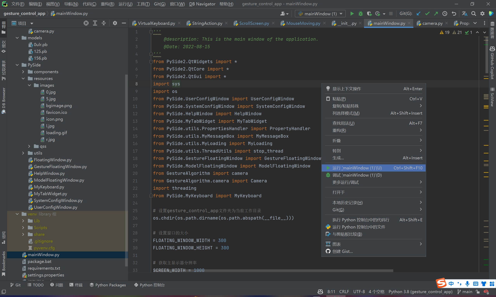   <br>    <div style="color:orange; border-bottom: 1px solid #d9d9d9;    display: inline-block;    color: #999;    padding: 2px;">源码运行</div> </center>


## 系统用户手册

1. **引言**

   本程序主要实现了采用手势进行操作电脑的功能, 用户可以用特定的手势操作鼠标或者进行特定的快捷操作, 在某些场合如幻灯片的翻页可以方便用户的操作。

2. **使用方法**

   本程序主要有鼠标控制模式和快捷手势模式两种模式

   (1)**鼠标控制模式**

   - 点击"启动鼠标控制"即可进入鼠标控制模式。
     手指全张开摆成数字五, 即可切换鼠标移动状态与上下滑动状态。

   - 鼠标移动状态下, 伸出食指朝某个方向滑动, 可以控制鼠标往该方向移动。
     - 手指滑动的越快,, 鼠标移动的幅度越大;
     - 可以在系统设置中调节鼠标灵敏度;
     - 用中指轻碰食指, 可以进行鼠标点击;
     - 食指中指摆出"V"形, 可以打开悬浮键盘。
   - 上下滑动状态下, 用食指向上或向下滑动, 即可实现页面的上下滚动。
     - 可以在系统设置中调节页面滚动速度。
     - 点击"停止"按钮或者按下`F1`键, 可以退出鼠标控制模式。

   (2)**快捷手势模式**

   - 点击"启动快捷键控制"即可进入快捷手势模式。
   - 快捷手势可以在用户自定义界面中查看并设置。
   - 快捷手势可以设置成快捷键和打开网址两种功能。
   - 点击"停止"按钮或者按下`F1`键, 可以退出快捷手势模式。

   (3)**设置说明**

   - 点击"系统设置"即可进入系统设置界面。
   - 系统设置界面目前共有三个选项, 可以拖动滑块进行调整数值, 也可以在数字输入框中输入特定数值并按回车。
   -  点击"用户自定义"即可进入用户自定义界面。
   -  点击下拉框可以更改当前手势的操作, 若当前操作是打开网页, 则在文本框中输入要打开的网址, 若当前操作是快捷键, 则点击文本框后按下键盘上想要设置的按键。
   - 所有设置完成后只有点击保存后才能将当前更改保存到本地。
   - 只有当保存完成之后再次点击"启动鼠标控制"或"启动快捷手势控制"所做的更改才能生效。如果在修改时正处在某种手指控制模式, 则需要先点击停止再重新点击某个启动按钮才能生效。


